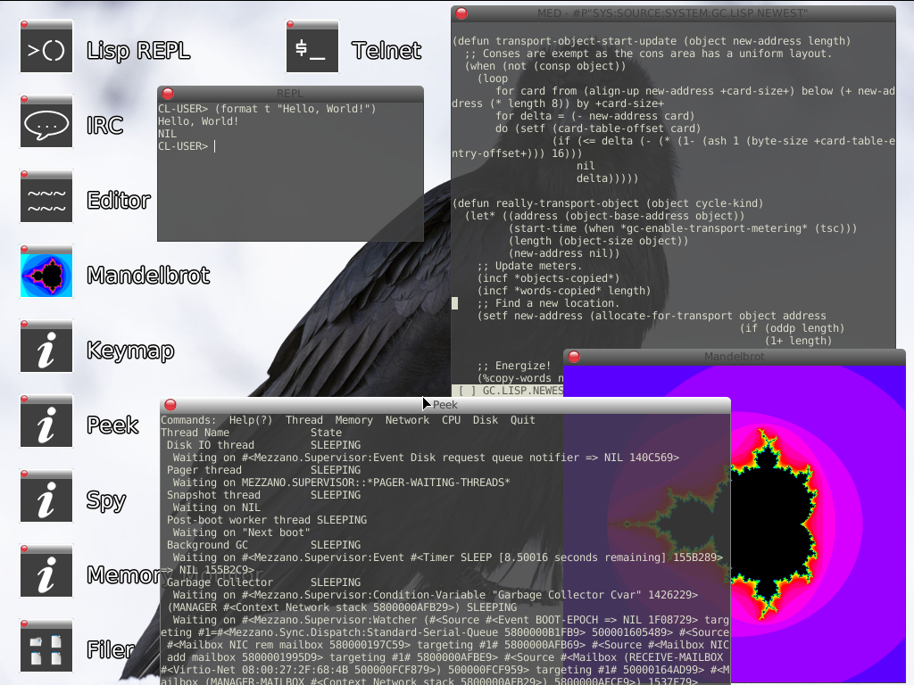

# Mezzano, an operating system written in Common Lisp.

## Pre-built images

Demo releases are available through [GitHub](https://github.com/froggey/Mezzano/releases).

These releases are designed to be run in VirtualBox, though QEMU is also supported.
2GB of RAM, a virtio-net NIC and an Intel HDA audio controller are recommended.

## Building from source

### Prerequisites

A recent 64-bit version of SBCL with Unicode support is required.
SBCL may be obtained at www.sbcl.org
Versions 1.2.4, 1.2.10, 1.3.1, 1.3.2, 1.3.5, and 1.4.5  are known to work.
Newer versions should work, but have not been tested.

The following systems should be installed using Quicklisp:
Alexandria
Iterate
Nibbles
CL-PPCRE
CL-FAD
closer-mop
trivial-gray-streams

To install the packages with Quicklisp, install SBCL and Quicklisp.  Then at a shell prompt, run:
sbcl --script /path/to/quicklisp.lisp
(on Debian and Ubuntu based Linux systems, if you install Quicklisp through the package manager it's in sbcl --script /usr/share/cl-quicklisp/quicklisp.lisp)
In SBCL type each of the following commands:
(quicklisp-quickstart:install)
(ql:add-to-init-file)
(ql:quickload "Alexandria")
(ql:quickload "Iterate")
(ql:quickload "Nibbles")
(ql:quickload "CL-PPCRE")
(ql:quickload "CL-FAD")
(quit)

### Quick Start

0. Set SBCL and FILE_SERVER_IP in the top-level Makefile.
   SBCL must point at the SBCL binary, and FILE_SERVER_IP to the IP address
   of the local machine.
   Note! Addresses on 10.0.2.0/24 networks are not supported (such as 10.0.2.5), as
   this conflicts with the network provided by QEMU and VirtualBox.
   IPv6 addresses are not supported.

1. Run "make cold-image-vmdk"
   This will build a cold image suitable for use with VirtualBox, and
   should only take a few minutes.

2. Run "make run-file-server"
   The file-server must be running during step 3.

3. Configure a VirtualBox VM to point at the new mezzano.vmdk image and run it.
   VM settings:
   General->Type: Other
            Version: Other/Unknown (64-bit)
   System->Motherboard->Base Memory: 2GB
   System->Acceleration->Enable VT-x/AMV-V: enabled
                         Enable Nested Paging: enabled
   Storage->IDE controller with mezzano.vmdk attached on the Primary Master hard disk.
   Network->Adapter 1: enabled
            Attached to: NAT
            Adapter Type (advanced): virtio-net
   Serial Ports->Port 1: enabled
            Port Mode: Raw file
            Path: /some/file
   Audio->Audio Controller: Intel HD Audio

4. Wait. The rest of the system is being compiled.
   Eventually a REPL and the desktop will appear.

4. Finish up.
   Once the desktop has appeared and the system has finished working (no blue
   run light) then (snapshot-and-exit) can be run in the initial REPL to
   finalize the state of the system and close the initial REPL.

### Using QEMU/KVM instead of VirtualBox

After building a cold image and starting the file-server as
described by the Quick Start section above run
"make qemu" or "make kvm" to run QEMU.
Using KVM is recommended as it is much faster than QEMU.

Note that the first time you run Mezzano, a lot of the code is compiled and boot time can take ten minutes or more on slow machines.  Subsequent boots are much faster, typically under two minutes.

For help & support or to follow development, join the #mezzano IRC channel on Libera Chat (irc.libera.chat)

## Major changes since Demo 4

* USB stack by fittestbits
* Improved overall file system support by fittestbits
* EXT2/3/4 support has been implemented by Bruno Cichon (ebrasca)
* GMA950 modesetting display driver
* Hardware accelerated 3D support via qemu's Virgl device
* Multicore/SMP support
* Improved atomic operations
* Async APIs: wait-for-objects, dispatch, and thread pools
* Networking improvements: Server support, DHCP, TCP retransmit
* Source locations are tracked for many kinds of definitions
* Weak hash tables and other weak objects
* Cleanup of object representation and unifcation of standard-object/structure-object
* Unboxed structure slots
* Short floats implemented using IEEE half floats
* Unboxed (unsigned-byte 64) arithmetic
* Stack overflows and memory faults are trapped and can be recovered from
* Support for building on Windows
* Major improvements to CLOS and MOP conformance
* Keymap picker
* More bug fixes, performance improvements and features

## Major changes since Demo 3

* FAT32 support has been implemented by Bruno Cichon (ebrasca).
* McCLIM has been ported by fittestbits.
* Quicklisp has been ported by Peter S. Housel.
* Improved introspection tools: DISASSEMBLE and ED have been implemented.
* Generational collection has been added to the garbage collector.
* New SSA-based compiler backend, supporting unboxed value representations.
* Gray streams support has been overhauled.

## Major changes since Demo 2

* Trentino, a media player, has been implemented by Eugene Zaikonnikov.
* Further improvements to conformance, stability and performance.
* The CLOS implementation follows the MOP much more closely.
* More traditional window management.
* Booting from CD/USB on real hardware is now possible.
* Driver support for Intel HDA audio devices.
* VirtualBox guest (mouse & display) integration.

## Major changes since Demo 1

* Many improvements to conformance, stability and performance.
* The editor has been greatly improved, thanks to Burton Samograd.
* The system now functions correctly on computers with more than 1GB of RAM.
* The allocator and garbage collector now make much better use of available memory, with far fewer GC cycles occuring.
* (ROOM T) prints more detailed information about allocated objects.
* Transparency and premultiplied alpha support in the GUI.
* And more!

## Additional information

"Hypothymis azurea - Kaeng Krachan" by JJ Harrison (jjharrison89@facebook.com)
[CC BY-SA 3.0 (http://creativecommons.org/licenses/by-sa/3.0)], via Wikimedia Commons
https://commons.wikimedia.org/wiki/File:Hypothymis_azurea_-_Kaeng_Krachan.jpg

"Mandarin Pair" by © Francis C. Franklin / CC-BY-SA-3.0.
Licensed under CC BY-SA 3.0 via Wikimedia Commons - http://commons.wikimedia.org/wiki/File:Mandarin_Pair.jpg

"Handsome" by Andy Morffew - https://www.flickr.com/photos/andymorffew/19377769093/in/album-72157630893775092/
[CC BY 2.0 (http://creativecommons.org/licenses/by/2.0)]

Includes Dejavu Fonts 2.37 (http://dejavu-fonts.org/)

Some icons from Icojam (http://www.icojam.com)
